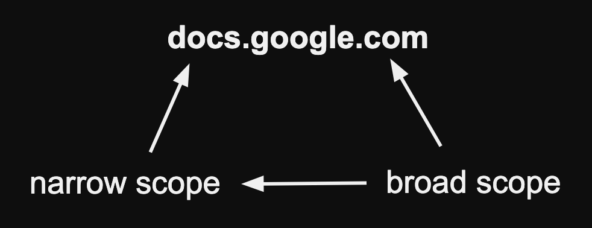
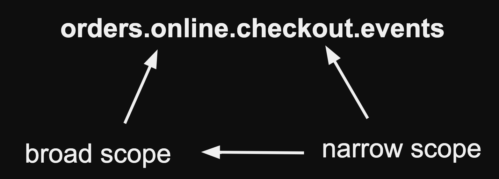

How to name and manage topics.
<!--more-->
---

The success of Event-Driven Architecture (EDA) isn’t just about getting the technology
right, it’s also about **how teams work together**, both within their own boundaries and
across
organizational lines. It’s about shared models built through meaningful naming, defined
ownership, and a mutual understanding of what each topic represents.

EDA introduces powerful decoupling between systems, but that decoupling also demands
alignment.
In this post, we’ll focus on two critical pillars of that alignment: topic naming and
ownership.

## Organizational Considerations

### Topic Naming Convention

> There are 2 hard problems in computer science:
> cache invalidation
> naming things

As your system grows to dozens or even hundreds of topics, a clear and consistent naming
convention becomes more than just a best practice, it becomes the foundation for a shared
understanding.

A well-defined <b style="color: #3da6b1;">Topic Naming
Convention</b>, captured in an **Architectural
Decision Record** (ADR), ensures that everyone knows what a topic represents, what kind of
data it carries, and how it fits into the broader model. It's a small investment that pays
off in alignment, clarity, and long-term maintainability.

#### Name topics like you would name your domains (DNS)

DNS provides an excellent model for structuring topic names.
Just like domain names, topics could follow a hierarchical approach, moving from a broad
scope (e.g., .com) to a more specific one, step by step.

This makes DNS-style naming a great foundation for a topic naming convention:

- Start with the broadest category and progressively narrow down.
- Use dots to separate different levels of specificity.

#### Domain Driven Design

This approach aligns well with Domain Driven Design (DDD) principles, where you can start
with the bounded-context
and then move to the subdomains all to the way down to the aggregate root.

#### Example Naming Conventions:

- E-commerce:
    - `prd.orders.in-store.checkout.events`
    - `prd.orders.online.checkout.events`
    - `prd.orders.online.refund.state`
    - `dev.products.inventory.events`
    - `dev.customers.profile.events`
- IoT
    - `dev.iot.sensors.temperature.room.events`
- Banking:
    - `dev.transactions.creditcard.fraud-alert.events`

#### Environment Prefix

Even if you operate with a dedicated Kafka cluster per environment (e.g., dev, staging,
prod), it's still a good idea to include an explicit environment prefix in your topic
names. 

This small redundancy helps eliminate ambiguity and protects against costly
mistakes like, accidentally producing or worse, deleting topics from the wrong environment. 

### Managing Topics

Now we know how to name things it is time to discuss how to actually create those topics.

### The Question of Ownership

Who actually owns, or, put differently, takes responsibility for the full lifecycle of a
topic? In many organizations, this responsibility falls on a DevOps or infrastructure
team. Often this stems from the fact that they are the ones who in the end are responsible
for the cluster.

However, this seems counterintuitive when compared to a more familiar business application
resource: the database table. Most teams manage their own database tables, using automated
tools like Flyway or Liquibase within a deployment pipeline or at startup. Yet, when it
comes to (Kafka) topics, this ownership model is rarely followed. _Why is that?_

The ultimate question is, who should be responsible for the full lifecycle of a topic?

To answer this question, you need to consider between two different approaches:
<b style="color: #3da6b1;">Centralized Approach</b> VS. <b style="color: #3da6b1;">
Distributed Approach.</b>

#### Centralized

In a centralized model, topic management is handled through a **single** repository.
Naturally, this repository brings up all kinds of wanted or unwanted **coupling**
concerns.

**🧷 Organizational Coupling**:
Changes to topics must go through a central team (like DevOps or Platform Engineering),
introducing a process bottleneck. Application teams become dependent on this team for
changes, which slows down development and increases friction and effectively creating
organizational silos.

**🚀 Deployment Coupling**:
Changes to topics need to be deployed together with the application code, which can lead
to increased complexity and coordination overhead during deployments.

#### Summarized

- ✅ Easier to enforce company-wide rules.
- ✅ Less complex when dealing with a small number of teams or services.
- ❌ Creates a bottleneck if the central team is unaware of specific use cases.
- ❌ Requires release coordination, making changes more convoluted and risky.
- ❌ Does not scale well as the number of teams and services grows.

#### Distributed Approach

In a distributed model, topics are logically coupled to the code that uses them, allowing
each team to manage their own topics.

🧷 **Ownership and Autonomy**:
Each application team has full ownership and responsibility for the topics which they are
master from and as such they produce on.
This fosters autonomy, allowing teams to tailor topic configurations to their
specific needs and iterate faster _without_ depending on a central authority.

🚀 **Decoupled Deployments**:
Topic changes are deployed as part of the application deployment lifecycle. This reduces
the need for cross-team coordination and the risk of infrastructure changes blocking
application releases. Teams can evolve their topics alongside their application code.

- ✅ Teams have full ownership and autonomy over their topics.
- ✅ Reduces dependencies on a central team, improving development speed.
- ✅ Allows for greater flexibility and customization based on specific needs.
- ✅ Scales well as the number of teams and services grows.
- ❌ Can lead to inconsistencies in naming conventions and configurations across teams.
- ❌ Requires each team to develop and maintain expertise in Kafka topic management.
- ❌ Makes it harder to enforce company-wide policies and standards consistently.

Each approach has its trade-offs, and the right choice depends on your organization’s
size, structure, and priorities.

---
A successful Event-Driven Architecture isn’t just about choosing the right tools, it's
about aligning technical practices with team ownership and organizational structure.
Whether centralized or distributed, what matters most is making the trade-offs explicit
and intentional.