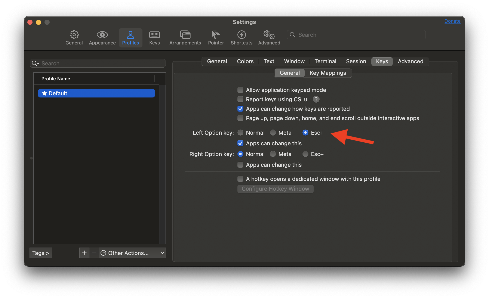
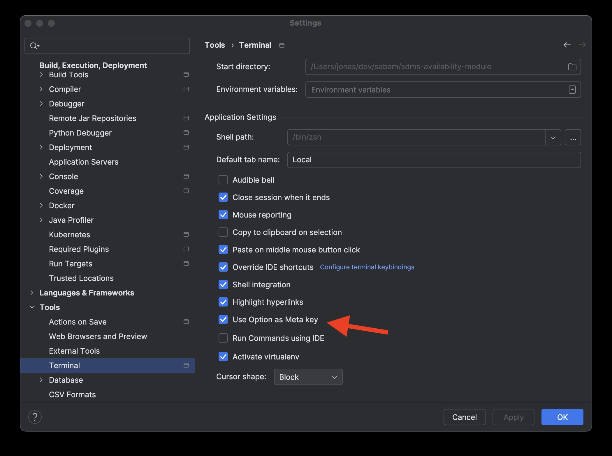

Tips and tricks to move swiftly on the command line.
<!--more-->
---

I grew up using the command line and have come to enjoy its efficiency and power. 
It often pains me to see colleagues struggling with it, using methods that seem 
cumbersome to me. Occasionally, they notice how swiftly I navigate the command line and 
ask what magic **Oh My Zsh plugin** I'm using. The truth is, it's just the good old 
**GNU Readline**, a tool created in 1989. Yes, it's that old!

## Readline

Readline has two editing modes: emacs and vi, with emacs being the default mode and the 
one we will focus on.

**Bash** makes use of Readline, while **Zsh** uses **ZLE (Zsh Line Editor)**, which has 
similar capabilities. So as long as you are using either of these shells, you should be 
good.

So let's get moving!

## Tools setup

Before we get started, let's make sure our tools are set up correctly. 
I am going to focus on **Mac** and the tools **iTerm2** and **IntelliJ**.

### Meta-key

The Meta key is a modifier key on certain keyboards that was originally found on early 
computer systems like the Lisp Machine and the Knight keyboard. Its function is similar 
to the Alt key on modern keyboards. In many software applications, including text 
editors and command-line interfaces, the Meta key is used to provide additional keyboard 
shortcuts.

On today's keyboards you won't find a Meta key,
but you can use the **Option** (mac) key. It just needs to be configured correctly.

### iTerm2

### Intellij

## Shortcuts 
### Movement

- `Ctrl-a`: Move to the beginning of the line.
- `Ctrl-e`: Move to the end of the line.
- `Ctrl-b`: Move backward one character.
- `Ctrl-f`: Move forward one character.
- `Alt-b`: Move backward one word.
- `Alt-f`: Move forward one word.
- `Ctrl-l`: Clear the screen, reprinting the current line at the top.

### Editing

- `Ctrl-d`: Delete the character under the cursor.
- `Ctrl-h or Backspace`: Delete the character to the left of the cursor.
- `Alt-d`: Delete the word after the cursor.
- `Alt-Backspace`: Delete the word before the cursor.
- `Ctrl-_ or Ctrl-x Ctrl-u`: Undo the last editing command.
- `Ctrl-k`: Cut the text from the cursor to the end of the line.
- `Ctrl-u`: Cut the text from the cursor to the beginning of the line.
- `Ctrl-w`: Cut the word before the cursor.
- `Ctrl-y`: Paste (yank) the last killed text.

### History

- `Ctrl-r`: Reverse search through history.
- `Ctrl-p`: Previous command in history.
- `Ctrl-n`: Next command in history.